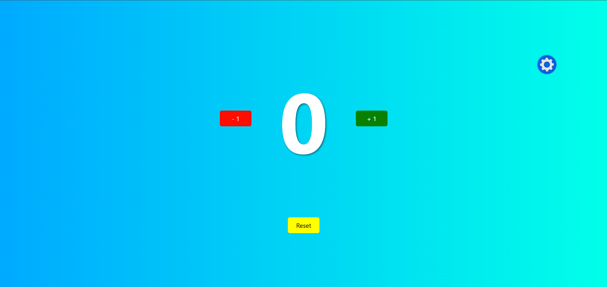

# 🔢 Simple Counter

Un contatore interattivo realizzato con JavaScript vanilla, che offre un'interfaccia pulita e animazioni fluide per un'esperienza utente ottimale.

## 📸 Screenshot



## ✨ Funzionalità

- **Incremento/Decremento**: Modifica il valore con i pulsanti +1 e -1
- **Reset rapido**: Riporta il contatore a 0 con un solo click
- **Valore personalizzato**: Imposta un numero iniziale a tua scelta
- **Temi personalizzabili**: Scegli tra diversi sfondi sfumati (Grigio, Blu, Verde)
- **Animazioni fluide**: Feedback visivo per ogni interazione
- **Design responsive**: Si adatta a qualsiasi dimensione dello schermo

## 🎨 Caratteristiche Tecniche

- Nessuna dipendenza esterna (solo JavaScript vanilla)
- Interfaccia costruita dinamicamente via DOM manipulation
- Animazioni CSS smooth e performanti
- Bootstrap 5 per gli stili base
- Protezione contro valori negativi

## 🚀 Come Utilizzare

1. Clona il repository
2. Apri `index.html` nel tuo browser
3. Inizia a usare il contatore!

### Comandi disponibili:

- **+ 1**: Incrementa il valore
- **- 1**: Decrementa il valore (minimo 0)
- **Reset**: Riporta il contatore a zero
- **⚙️ Impostazioni**: 
  - Imposta un valore iniziale personalizzato
  - Cambia lo sfondo tra Grigio, Blu o Verde

## 📁 Struttura del Progetto
```
ProgettoJS/
│
├── index.html              # Pagina principale
├── assets/
│   ├── styles.css         # Stili e animazioni
│   └── images/            # Immagini e icone
└── js/
    └── app.js             # Logica dell'applicazione
```

## 🛠️ Tecnologie Utilizzate

- HTML5
- CSS3 (Animazioni, Gradients, Flexbox)
- JavaScript ES6+
- Bootstrap 5.3.8

## 📝 Note

Il progetto è stato creato come esercizio di apprendimento per praticare la manipolazione del DOM e le animazioni CSS in JavaScript vanilla.

## 📄 Licenza

Progetto open source - sentiti libero di usarlo e modificarlo!

---

⭐ Se ti piace il progetto, lascia una stella!
